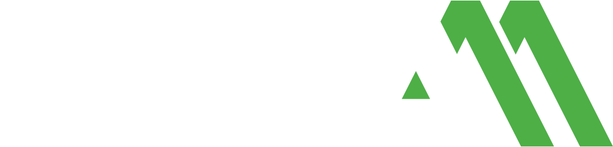

# AGENTS.md — BKM Mannesmann AG

> Implementation guidance for AI agents. Read `DESIGN.md` first for normative token definitions. This file provides the code translation layer.

## Critical Rules

1. **The Keyvisual is a pre-rendered image asset. NEVER recreate it in code.** No SVG generation, no CSS clip-paths, no procedural patterns. Place the provided image file, right-aligned, cropped.
2. **One brand, two color contexts.** BKM AG uses Deep Green + Lime on dark surfaces. Fachbetrieb uses White/Sand White surfaces with Transition Green + Pure Green accents. Stone Grey is text color only in Fachbetrieb — never a dominant surface.
3. **Lime Green = interactive only (BKM AG context).** Never decorative. Never on text. Never on large surfaces. Never in Fachbetrieb context.
4. **The greens tell a story.** Deep Green = moisture/problem. Pure Green = dry/solution. This is not arbitrary branding — it visualizes the drying process.
5. **Max ONE primary button per viewport fold.**
6. **Cards: context-dependent technique.** Website = shadow-as-border. Slides/Print = 4px colored border-left (no shadow).
7. **Unbounded: weight 900, uppercase, 18px minimum.** No exceptions.
8. **Hard cuts between surface modes.** Never gradients, waves, or diagonals.
9. **Slides are editorial, not web design.** No noise textures, no aurora gradients, no bento grids, no floating badges. Clean flat surfaces + photography + whitespace.
10. **Glasmorphismus is allowed** in both contexts as an optional overlay technique on photo backgrounds. Use sparingly (max 1–2 elements per viewport).

## Quick Start

```html
<!-- 1. Load fonts -->
<link rel="preconnect" href="https://fonts.googleapis.com" />
<link rel="preconnect" href="https://fonts.gstatic.com" crossorigin />
<!-- This old URL was replaced by the @font-face block above -->
```

```css
/* 2. Set CSS variables */
:root {
  --bkm-deep-green: #1c4b42;
  --bkm-deep-green-light: #2a6b5e;
  --bkm-transition-green: #287d4b;
  --bkm-pure-green: #4daf46;
  --bkm-lime: #b4e717;
  --bkm-stone-grey: #494949;
  --bkm-sand-white: #f6f5f2;
  --bkm-surface: #ffffff;
  --bkm-ink: #1a1a1a;
  --bkm-on-dark: #ffffff;

  --bkm-shadow-subtle: rgba(0,0,0,0.08) 0px 0px 0px 1px, rgba(0,0,0,0.04) 0px 2px 4px;
  --bkm-shadow-featured: rgba(0,0,0,0.08) 0px 0px 0px 1px, rgba(0,0,0,0.06) 0px 8px 16px -4px;
  --bkm-shadow-elevated: rgba(0,0,0,0.08) 0px 0px 0px 1px, rgba(0,0,0,0.08) 0px 12px 24px -8px;
}
```

## Determining Context

Before writing any code, determine which color context applies:

| Context | When | Primary Color | Accent Color | Nav Background |
|---------|------|---------------|--------------|----------------|
| **BKM AG** | Corporate site, products, shop, marketing | Deep Green (#1c4b42) | Lime (#b4e717) | Deep Green |
| **Fachbetrieb** | Specialist company pages, partner portal, certification | Transition Green (#287d4b) for headlines/bands, Stone Grey (#494949) for text only | Pure Green (#4daf46) | Transition Green (#287d4b) — NOT Stone Grey |

The design structure (typography, spacing, shadows, layout) is identical. Only the color mapping changes.

## Keyvisual Implementation

```html
<!-- CORRECT: Image asset, right edge, cropped -->
<section class="relative overflow-hidden bg-[#1c4b42]">
  
  <div class="relative z-10"><!-- content --></div>
</section>

<!-- WRONG — NEVER do any of these -->
<svg>...</svg>                              <!-- No SVG recreation -->
<div class="bg-[url('chevron.svg')]"></div>  <!-- No tiling -->
<div style="clip-path: polygon(...)"></div>  <!-- No CSS approximation -->
```

When to skip the Keyvisual: Instagram posts, email templates, UI components, technical data sheets, any surface smaller than a full-width hero.

## BKM AG Context — Component Patterns

### Hero Band (Dark Surface)

```html
<section class="relative overflow-hidden bg-[#1c4b42] min-h-[560px]">
  <div class="max-w-[1280px] mx-auto px-8 md:px-16 py-40">
    <p class="font-['TT_Norms_Pro'] text-[13px] font-semibold uppercase tracking-[1.5px] text-white/50 mb-6">
      Bauwerksabdichtung seit 1928
    </p>
    <h1 class="font-['Unbounded'] text-5xl md:text-7xl font-black uppercase text-white tracking-[-0.04em] leading-none max-w-[800px]">
      SCHUTZ DER HÄLT
    </h1>
    <p class="font-['TT_Norms_Pro'] text-xl text-white/70 mt-6 max-w-[640px] leading-relaxed">
      Professionelle Bauwerksabdichtung mit MicroPorex® Technologie.
    </p>
    <button class="mt-10 bg-[#b4e717] text-[#1c4b42] font-['Unbounded'] text-sm font-black uppercase
                   px-6 py-3 h-12 rounded-[4px] tracking-[0.02em]
                   hover:bg-white transition-colors duration-150">
      PRODUKTE ENTDECKEN
    </button>
  </div>
</section>
```

### Card (Light Surface, Shadow-as-Border)

```html
<div class="bg-white p-8 rounded-[12px]
            shadow-[rgba(0,0,0,0.08)_0px_0px_0px_1px,rgba(0,0,0,0.04)_0px_2px_4px]
            hover:shadow-[rgba(0,0,0,0.08)_0px_0px_0px_1px,rgba(0,0,0,0.06)_0px_8px_16px_-4px]
            hover:-translate-y-0.5 transition-all duration-200">
  <span class="inline-flex bg-[#1c4b42] text-[#b4e717] font-['TT_Norms_Pro'] text-xs font-bold uppercase tracking-[0.05em] px-2.5 py-1 rounded-[4px]">
    PRO LINE
  </span>
  <h3 class="font-['Unbounded'] text-lg font-black uppercase tracking-tight text-[#1a1a1a] mt-4">
    KELLERSCHUTZ PRO
  </h3>
  <p class="font-['TT_Norms_Pro'] text-base text-[#494949] mt-3 leading-relaxed">
    Professionelle Horizontalsperre mit MicroPorex® Technologie.
  </p>
  <span class="inline-block mt-4 font-['TT_Norms_Pro'] text-sm font-medium text-[#1c4b42]">
    ab 89,90 €
  </span>
</div>
```

### Spec Table (Technical Data)

```html
<div class="divide-y divide-[#e8e6e1]">
  <div class="flex justify-between items-center py-3">
    <span class="font-['TT_Norms_Pro'] text-sm text-[#6b6b6b]">Schichtdicke</span>
    <span class="font-['TT_Norms_Pro'] text-sm font-medium text-[#1c4b42]">2,5 mm</span>
  </div>
  <div class="flex justify-between items-center py-3">
    <span class="font-['TT_Norms_Pro'] text-sm text-[#6b6b6b]">Verbrauch</span>
    <span class="font-['TT_Norms_Pro'] text-sm font-medium text-[#1c4b42]">1,2 kg/m²</span>
  </div>
  <div class="flex justify-between items-center py-3">
    <span class="font-['TT_Norms_Pro'] text-sm text-[#6b6b6b]">Trocknungszeit</span>
    <span class="font-['TT_Norms_Pro'] text-sm font-medium text-[#1c4b42]">24 h</span>
  </div>
</div>
```

## Fachbetrieb Context — Color Swap

Same structure, different palette:

```html
<!-- Fachbetrieb Navigation: Transition Green (NOT Stone Grey — too heavy) -->
<nav class="bg-[#287d4b] h-16 sticky top-0">
  <a class="text-white hover:text-[#4daf46] transition-colors">...</a>
</nav>

<!-- Fachbetrieb Hero: Light surface — White/Sand White dominates -->
<section class="bg-white py-40">
  <h1 class="font-['Unbounded'] text-5xl font-black uppercase text-[#287d4b]">
    IHR ZERTIFIZIERTER FACHBETRIEB
  </h1>
  <p class="font-['TT_Norms_Pro'] text-lg text-[#494949] mt-6">
    Stone Grey is the text color, never the background.
  </p>
  <button class="bg-[#287d4b] text-white font-['Unbounded'] text-sm font-black uppercase
                 px-6 py-3 h-12 rounded-[4px] hover:bg-[#4daf46] transition-colors">
    TERMIN VEREINBAREN
  </button>
</section>

<!-- Fachbetrieb Badge: Transition Green (readable on white) -->
<span class="inline-flex bg-[#287d4b] text-white font-['TT_Norms_Pro'] text-xs font-bold uppercase px-2.5 py-1 rounded-[4px]">
  ZERTIFIZIERT
</span>

<!--
  CRITICAL: Stone Grey (#494949) in Fachbetrieb context:
  ✓ Text color on light backgrounds
  ✓ Footer text
  ✓ Divider lines
  ✗ Navigation background (use Transition Green)
  ✗ Hero background (use White/Sand White)
  ✗ Card background (use White)
  ✗ Any dominant surface
-->
```

## Slide/Editorial Implementation Patterns

These patterns apply when creating slides, pitch decks, brochures, or any print-adjacent HTML output. They differ from the website patterns above.

### Title Slide with Vertical Lime Accent Line (BKM AG)

```html
<div class="slide" style="background: #1c4b42; position: relative; width: 100vw; height: 100vh; overflow: hidden;">
  <!-- Vertical Lime accent line -->
  <div style="position: absolute; left: 8%; top: 20%; width: 4px; height: 60%; background: #b4e717;"></div>
  
  <!-- Logo -->
  
  
  <!-- Content block (aligned to accent line) -->
  <div style="position: absolute; left: 10%; top: 25%; max-width: 70%;">
    <h1 style="font-family: 'Unbounded'; font-weight: 900; font-style: italic; 
               color: #ffffff; font-size: 72px; line-height: 1.0; letter-spacing: -0.04em;">
      HEADLINE TEXT
    </h1>
    <p style="font-family: 'TT Norms Pro'; font-weight: 400; font-style: italic;
              color: rgba(255,255,255,0.7); font-size: 20px; margin-top: 24px;">
      Subtitle text here
    </p>
    <div style="margin-top: 32px; display: flex; align-items: center; gap: 12px;">
      <span style="color: #b4e717; font-size: 14px;">●</span>
      <span style="font-family: 'TT Norms Pro'; color: #b4e717; font-size: 14px;">Author • Date</span>
    </div>
  </div>
</div>
```

### Content Slide with Cards + Footer Bar

```html
<div class="slide" style="background: #f5f0eb; position: relative; width: 100vw; height: 100vh; display: flex; flex-direction: column;">
  <!-- Content area -->
  <div style="flex: 1; padding: 60px 80px;">
    <h2 style="font-family: 'Unbounded'; font-weight: 900; color: #4daf46; 
               font-size: 44px; letter-spacing: -0.02em;">
      Section Headline
    </h2>
    
    <!-- Card grid -->
    <div style="display: grid; grid-template-columns: 1fr 1fr; gap: 24px; margin-top: 40px;">
      <div style="background: #ffffff; border-left: 4px solid #1c4b42; 
                  border-radius: 8px; padding: 24px;">
        <h3 style="font-family: 'TT Norms Pro'; font-weight: 700; color: #1a1a1a; font-size: 18px;">
          Card Title
        </h3>
        <p style="font-family: 'TT Norms Pro'; font-weight: 400; color: #494949; 
                  font-size: 15px; margin-top: 8px; line-height: 1.5;">
          Card body text with description.
        </p>
      </div>
      <!-- More cards... -->
    </div>
  </div>
  
  <!-- Deep Green Footer Bar -->
  <div style="background: #1c4b42; padding: 16px 80px; display: flex; align-items: center; gap: 12px;">
    <span style="color: #b4e717; font-size: 18px;">✓</span>
    <span style="font-family: 'TT Norms Pro'; color: #ffffff; font-size: 14px;">
      Key takeaway or navigation text
    </span>
  </div>
</div>
```

### Glasmorphismus Overlay on Photo Background

```html
<div class="slide" style="position: relative; width: 100vw; height: 100vh; overflow: hidden;">
  <!-- Background photo -->
  
  
  <!-- Dark overlay for readability -->
  <div style="position: absolute; inset: 0; background: rgba(28, 75, 66, 0.6);"></div>
  
  <!-- Glass card -->
  <div style="position: absolute; top: 50%; left: 10%; transform: translateY(-50%); max-width: 500px;
              background: rgba(255, 255, 255, 0.12); backdrop-filter: blur(16px);
              -webkit-backdrop-filter: blur(16px); border: 1px solid rgba(255, 255, 255, 0.15);
              border-radius: 12px; padding: 40px;">
    <h2 style="font-family: 'Unbounded'; font-weight: 900; color: #ffffff; font-size: 36px;">
      Glass Card Headline
    </h2>
    <p style="font-family: 'TT Norms Pro'; color: rgba(255,255,255,0.8); font-size: 16px; margin-top: 16px;">
      Content text on glass surface.
    </p>
  </div>
</div>
```

## Tailwind v4 Theme

```css
@theme {
  --color-bkm-deep-green: #1c4b42;
  --color-bkm-deep-green-light: #2a6b5e;
  --color-bkm-transition-green: #287d4b;
  --color-bkm-pure-green: #4daf46;
  --color-bkm-lime: #b4e717;
  --color-bkm-stone-grey: #494949;
  --color-bkm-sand-white: #f6f5f2;
  --color-bkm-surface: #ffffff;
  --color-bkm-ink: #1a1a1a;
  --color-bkm-outline: #c8c5be;
  --color-bkm-error: #dc2626;

  --font-display: 'Unbounded', system-ui, sans-serif;
  --font-body: 'TT Norms Pro', system-ui, sans-serif;
  --font-mono: 'TT Norms Pro', system-ui, sans-serif;

  --radius-sm: 4px;
  --radius-md: 8px;
  --radius-lg: 12px;
  --radius-xl: 16px;
  --radius-full: 9999px;

  --spacing-xs: 4px;
  --spacing-sm: 8px;
  --spacing-md: 16px;
  --spacing-lg: 24px;
  --spacing-xl: 32px;
  --spacing-xxl: 48px;
  --spacing-section: 80px;
  --spacing-hero: 160px;
}
```

## Format Compliance

This design system follows the [Google design.md specification](https://github.com/google-labs-code/design.md). Validate with:

```bash
npx @google/design.md lint DESIGN.md
```

Export to Tailwind v4:

```bash
npx @google/design.md export --format css-tailwind DESIGN.md
```

## Checklist Before Delivery

### Universal (All Contexts)

- [ ] Determined context: BKM AG or Fachbetrieb?
- [ ] Keyvisual placed as image (if applicable) — not generated in code
- [ ] Surface modes alternate with hard cuts (no gradients)
- [ ] Lime used ONLY for interactive elements (BKM AG context only)
- [ ] Pure Green used for Fachbetrieb accents (not Lime)
- [ ] Fachbetrieb surfaces are WHITE/SAND WHITE — Stone Grey is text only, never a surface
- [ ] Unbounded: weight 900, 18px minimum. H1 uppercase, H2+ sentence case
- [ ] TT Norms Pro self-hosted from assets/fonts/ (not Google Fonts)
- [ ] Body text in TT Norms Pro Regular (400), emphasis in Bold (700)
- [ ] Only ONE primary button per viewport fold
- [ ] WCAG AA contrast ratios met (4.5:1 minimum)

### Website/Digital Only

- [ ] Cards use shadow-as-border (no CSS border property)
- [ ] Fachbetrieb nav uses Transition Green (#287d4b) — not Stone Grey
- [ ] Technical values in TT Norms Pro Regular (400)

### Slides/Print/Editorial Only

- [ ] Background is ONLY Deep Green or Sand/Beige (no third option)
- [ ] Cards use 4px colored border-left (no shadow, no CSS border)
- [ ] No noise textures, aurora gradients, or animated effects
- [ ] Glasmorphismus used sparingly if at all (max 1–2 elements)
- [ ] At least 40% of surface is photography or visual content
- [ ] At least 25% whitespace maintained
- [ ] Deep Green footer bar present on content slides
- [ ] Vertical Lime accent line on BKM AG title slides
- [ ] No bento grids, floating badges, or spotlight effects
- [ ] Typography: only 3 levels (Unbounded Bold headline, TT Norms Pro Bold subtitle, TT Norms Pro Regular body)
